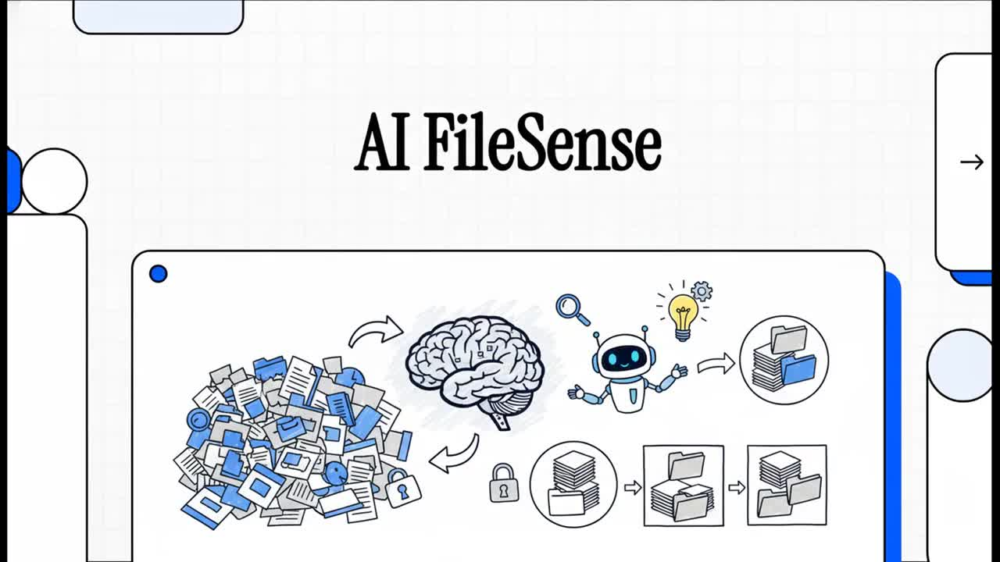
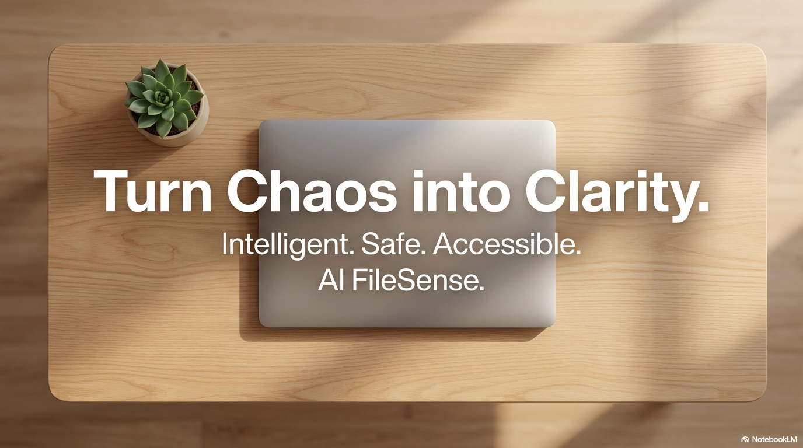
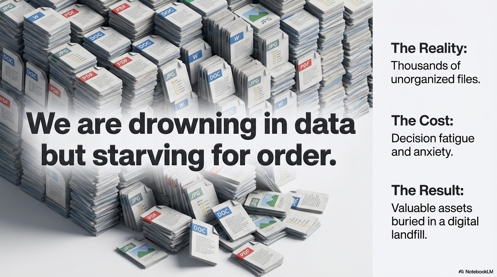
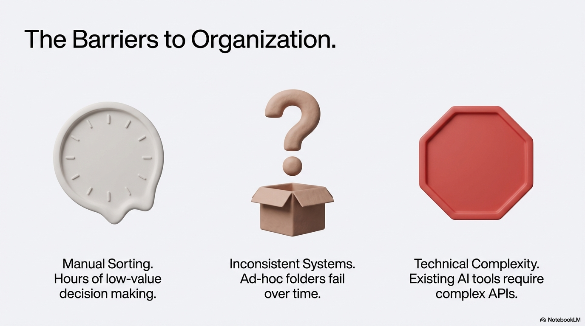
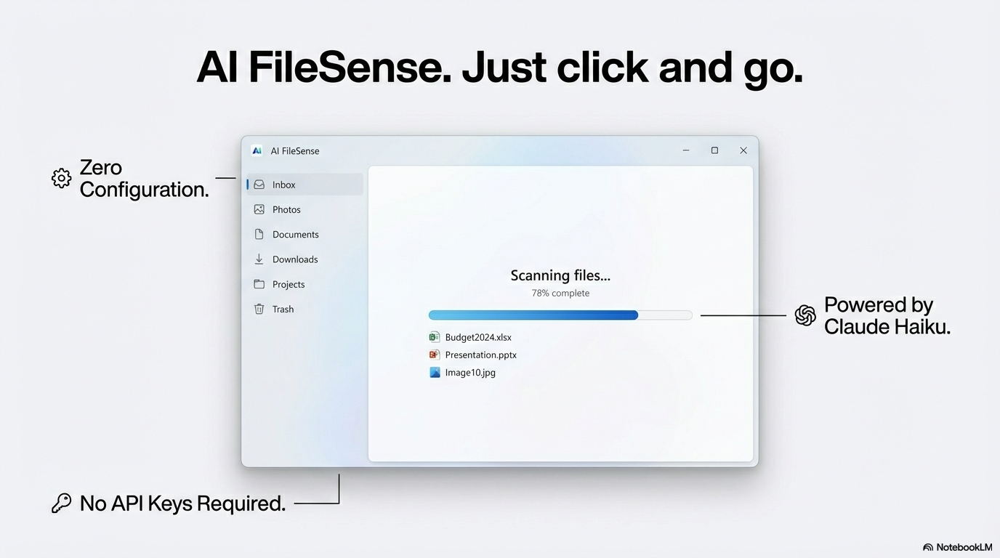
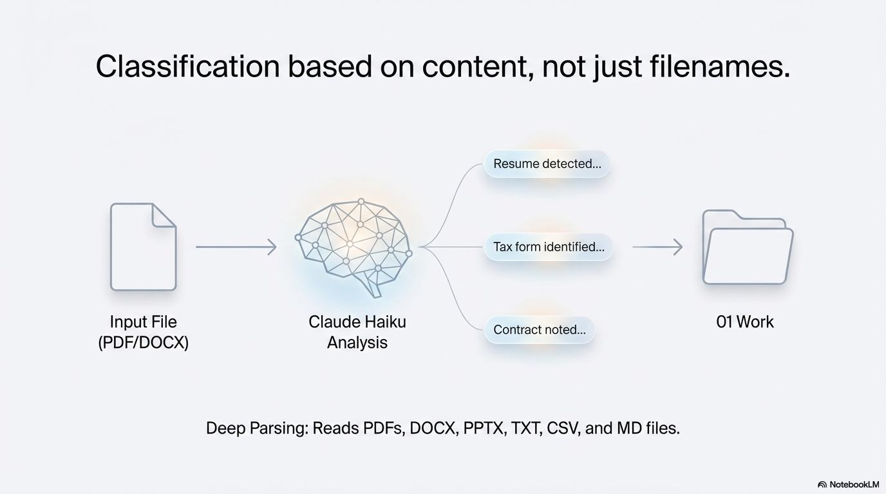
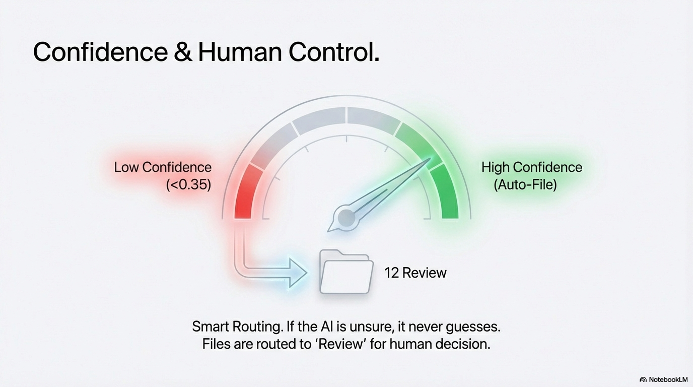
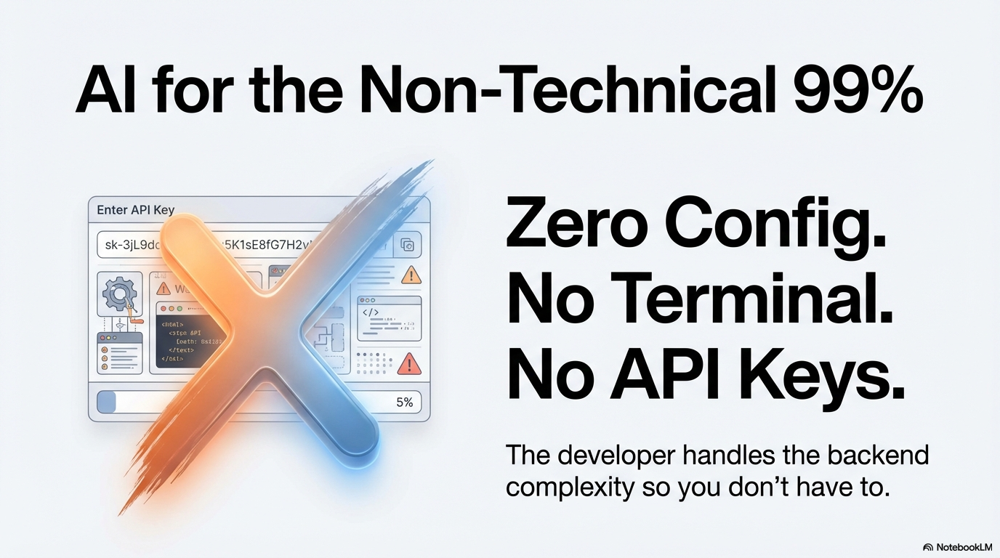
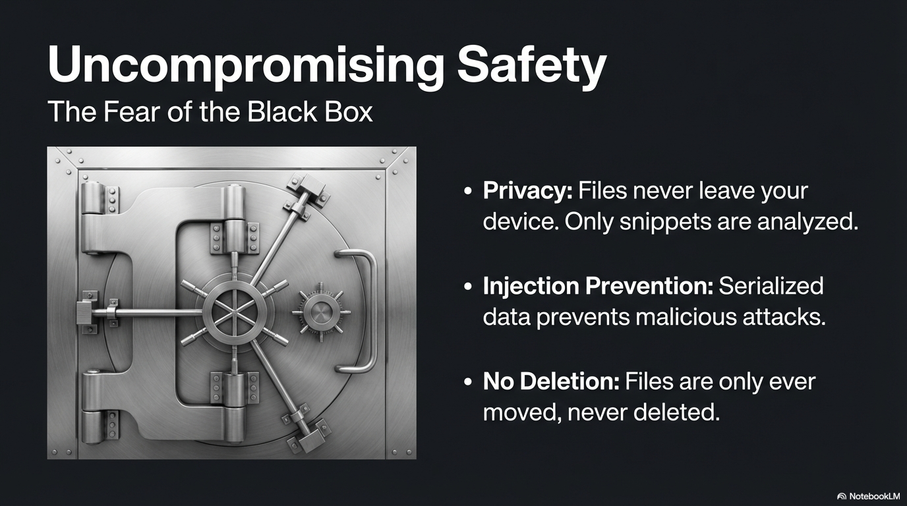
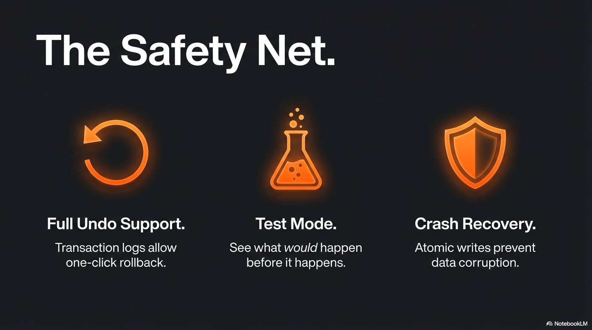

---
# === CONTROL FLAGS ===
portfolio_enabled: true
portfolio_priority: 3
portfolio_featured: true

# === CARD DISPLAY ===
title: "AI FileSense"
tagline: "AI-powered local file organization for Windows — private, safe, and accessible to everyone"
slug: "ai-filesense"
category: "AI Automation"
tech_stack:
  - "Tauri 2"
  - "Rust"
  - "React"
  - "TypeScript"
  - "SQLite"
  - "Claude Haiku"
  - "shadcn/ui"
  - "Tailwind CSS"
thumbnail: "public/images/ai-filesense-02.png"
status: "In Development"

# === DETAIL PAGE ===
problem: "Most people have hundreds or thousands of documents scattered across Desktop, Documents, and Downloads with no system. Manual organization takes hours and most people quit after 10 minutes. Cloud-based solutions require uploading sensitive personal files to third-party servers. Existing AI tools demand API keys, terminals, and developer knowledge — locking out the 99% of users who aren't technical."
solution: "A Windows desktop app that uses AI to read document content and classify files into a clean, consistent 12-folder system. Files never leave the device. Every move is logged and fully reversible. Zero configuration required — the developer provides the API key so users never touch a terminal or API console."
key_features:
  - "Content-based AI classification — reads PDFs, DOCX, PPTX, TXT, not just filenames"
  - "12-folder numbered system (Work, Money, Home, Health, Legal, School, Family, Clients, Projects, Travel, Archive, Review) with smart subcategories"
  - "Full undo support — rollback a single file or entire session, even after app restart"
  - "Crash recovery — detects incomplete sessions and offers resume, rollback, or discard"
  - "Confidence-based routing — uncertain files go to Review for human decision, never mis-filed"
  - "Native bilingual UI — English + Spanish (Mexico) throughout, including AI-generated questions"
  - "Zero config freemium — developer-provided API key, no accounts, no setup"
  - "Privacy-first — files stay local, only 300-char snippets sent to AI, prompt injection prevention via serde_json"
  - "Test mode by default — preview all changes before anything actually moves"
  - "~5 MB app size (Tauri 2) vs ~200 MB for Electron equivalents"
metrics:
  - "$0.0015 per file classified"
  - "~5 minutes from install to organized"
  - "12 universal folder categories"
  - "10 free scans per user (backend-enforced)"

# === LINKS ===
video_brief:
  path: "public/video/AI_FileSense-brief.mp4"
  poster: "public/video/AI-FileSense-brief-poster.jpg"
  alt: "AI FileSense product brief — from digital chaos to automated order"
  caption: "60-second product brief showing how AI FileSense turns file clutter into a clean, consistent 12-folder system."
demo_url: ""
live_url: ""

# === OPTIONAL ===
hero_images:
  - path: "public/images/ai-filesense-02.png"
    alt: "Turn Chaos into Clarity — AI FileSense hero slide"
    caption: "Intelligent. Safe. Accessible."
  - path: "public/images/ai-filesense-03.png"
    alt: "We are drowning in data but starving for order"
    caption: "The problem: thousands of unorganized files creating decision fatigue and buried assets."
  - path: "public/images/ai-filesense-04.png"
    alt: "The Barriers to Organization"
    caption: "Manual sorting, inconsistent systems, and technical complexity keep people from organizing."
  - path: "public/images/ai-filesense-05.png"
    alt: "The Barriers to Organization (continued)"
    caption: "Hours of low-value decision making, ad-hoc folders that fail, and AI tools that require complex APIs."
  - path: "public/images/ai-filesense-06.png"
    alt: "AI FileSense — Just click and go"
    caption: "Zero configuration. No API keys required. Powered by Claude Haiku."
  - path: "public/images/ai-filesense-07.png"
    alt: "Classification based on content, not just filenames"
    caption: "Deep parsing reads PDFs, DOCX, PPTX, TXT, CSV, and MD files to understand what each document actually is."
  - path: "public/images/ai-filesense-09.png"
    alt: "Confidence and Human Control"
    caption: "Smart routing: high-confidence files are auto-filed, low-confidence files route to Review for human decision."
  - path: "public/images/ai-filesense-10.png"
    alt: "AI for the Non-Technical 99%"
    caption: "Zero config, no terminal, no API keys. The developer handles backend complexity so users don't have to."
  - path: "public/images/ai-filesense-11.png"
    alt: "Uncompromising Safety"
    caption: "Privacy by design: files never leave the device, injection prevention via serialization, no files ever deleted."
  - path: "public/images/ai-filesense-12.png"
    alt: "The Safety Net"
    caption: "Full undo support, test mode to preview changes, and crash recovery with atomic writes."
  - path: "public/images/ai-filesense-13.png"
    alt: "From Digital Chaos to Automated Order — full system architecture"
    caption: "Complete system view: from digital clutter through local AI processing to the universal 12-folder structure."
tags:
  - "ai"
  - "desktop-app"
  - "file-organization"
  - "tauri"
  - "rust"
  - "privacy-first"
  - "bilingual"
  - "windows"
date_completed: "2026-02"
---

## About This Project

AI FileSense solves a universal problem: digital file clutter. Most people have thousands of documents scattered across their Desktop, Documents, and Downloads folders with no organizational system. Manual sorting takes hours and most people abandon the effort within minutes. Cloud-based solutions like Google Drive or Dropbox require uploading sensitive personal files — tax returns, medical records, contracts — to third-party servers.

AI FileSense takes a different approach. It's a lightweight Windows desktop app (~5 MB) that uses Claude Haiku to read actual document content and classify each file into a consistent 12-folder system. Files never leave the user's computer — only filenames and 300-character text snippets are sent to the AI. Every file move is transaction-logged with full undo support, crash recovery, and a test mode that lets users preview changes before anything moves.

The key differentiator is accessibility. Unlike other AI tools that require API keys, terminal commands, and developer knowledge, AI FileSense requires zero configuration. The developer provides the Anthropic API key via a freemium model — users just click "Scan" and the AI does the rest. The app is also natively bilingual (English + Spanish/Mexico), serving the large US Hispanic market with a first-class localized experience, not a machine-translated afterthought.

## Video Brief

**60-second product brief** showing how AI FileSense turns file clutter into a clean, consistent 12-folder system — powered by Claude Haiku, fully local, and zero configuration required.

## Slide Deck

| # | Slide | Message |
|---|-------|---------|
| 1 |  | **Turn Chaos into Clarity.** Intelligent. Safe. Accessible. |
| 2 |  | **Drowning in data, starving for order.** Thousands of files, decision fatigue, buried assets. |
| 3 |  | **Three barriers:** Manual sorting, inconsistent systems, technical complexity. |
| 4 |  | Hours of low-value decisions. Ad-hoc folders that fail. AI tools requiring complex APIs. |
| 5 |  | **Just click and go.** Zero configuration. No API keys. Powered by Claude Haiku. |
| 6 |  | **Content-based classification.** Reads PDFs, DOCX, PPTX, TXT — not just filenames. |
| 7 |  | **Smart routing.** High confidence = auto-file. Low confidence = human Review. |
| 8 |  | **AI for the non-technical 99%.** No terminal. No API keys. No config. |
| 9 |  | **Uncompromising safety.** Privacy, injection prevention, no deletion. |
| 10 |  | **The Safety Net.** Full undo. Test mode. Crash recovery. |
| 11 |  | **From chaos to order.** Complete system: AI processing into 12 universal folders. |
