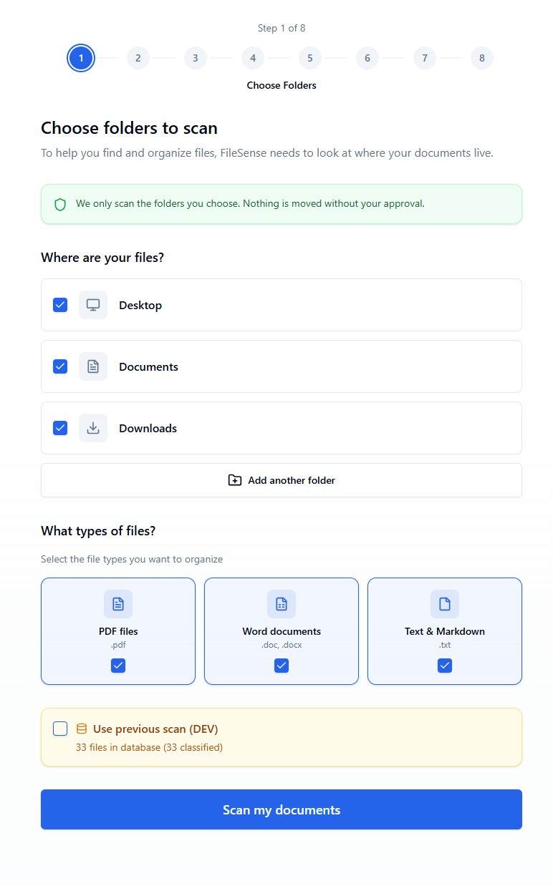

# AI FileSense

> AI-powered local file organization for Windows

[](LICENSE)
[]()
[](https://tauri.app)
[]()

AI FileSense uses artificial intelligence to understand and organize your files based on their actual content—not just filenames. Clean up your Desktop in minutes with AI-powered categorization.



Built for Windows users who want to organize their Desktop, Documents, and Downloads without uploading files to the cloud.

**Website:** [ai-filesense-website.vercel.app](https://ai-filesense-website.vercel.app)

---

## Phase 1 Features

### Core Capabilities

- **AI-Powered Classification** — Uses Claude Haiku to categorize files by actual content analysis
- **12-Folder Smart System** — Organized numbered folders (01 Work, 02 Money, 03 Home, etc.) that sort consistently across file systems
- **3-Level Organization Depth** — Choose from Lightly Organized, More Organized, or Fully Organized folder structures
- **Safe & Reversible** — Preview every change before it happens, with one-click undo
- **Privacy First** — All file scanning happens locally; only small text snippets sent to AI for classification
- **Fully Bilingual** — Complete English and Spanish (Mexico) support throughout the entire app

### Supported File Types

| Type | Extensions | Content Extraction |
|------|------------|-------------------|
| PDF Documents | `.pdf` | First page text extraction |
| Word Documents | `.doc`, `.docx` | Full text extraction via XML parsing |
| PowerPoint | `.pptx` | Slide text extraction |
| Text Files | `.txt`, `.md`, `.log`, `.csv` | First 100 lines |

### Smart Categories

Files are automatically sorted into 12 life-area categories:

| # | Category | What Goes Here |
|---|----------|----------------|
| 01 | Work | Resumes, job offers, performance reviews, payslips |
| 02 | Money | Bank statements, taxes, investments, receipts, invoices |
| 03 | Home | Mortgage, rent, utilities, repairs, warranties |
| 04 | Health | Medical records, prescriptions, lab results, insurance |
| 05 | Legal | Contracts, agreements, licenses, IDs, passports |
| 06 | School | Courses, certificates, transcripts, research |
| 07 | Family | Family correspondence, kids' records, personal letters |
| 08 | Clients | Client docs, vendor contracts, invoices (freelancers/SMB) |
| 09 | Projects | Project deliverables, milestones, active work |
| 10 | Travel | Itineraries, bookings, boarding passes, visas |
| 11 | Archive | Old docs (3+ years), completed projects, historical |
| 12 | Review | Low-confidence items needing manual sorting |

---

## User Journey (5 Steps)

```
┌─────────────────────────────────────────────────────────────────────────┐
│  STEP 1: Choose Folders                                                  │
│  Select Desktop, Documents, Downloads, or add custom folders             │
│  Pick which file types to organize (PDF, Word, Text, PowerPoint)         │
└─────────────────────────────────────────────────────────────────────────┘
                                    ↓
┌─────────────────────────────────────────────────────────────────────────┐
│  STEP 2: Scan                                                            │
│  AI analyzes file content (locally extracted, snippets sent to AI)       │
│  Progress bar with reassuring status messages                            │
└─────────────────────────────────────────────────────────────────────────┘
                                    ↓
┌─────────────────────────────────────────────────────────────────────────┐
│  STEP 3: Preview                                                         │
│  See how files will be organized across categories                       │
│  Review results, exclude files, answer AI clarifying questions           │
│  Choose organization depth (light, moderate, detailed)                   │
└─────────────────────────────────────────────────────────────────────────┘
                                    ↓
┌─────────────────────────────────────────────────────────────────────────┐
│  STEP 4: Organize                                                        │
│  Files move to Documents/Organized Files/                                │
│  Real-time progress with file counts                                     │
│  Every move logged for undo capability                                   │
└─────────────────────────────────────────────────────────────────────────┘
                                    ↓
┌─────────────────────────────────────────────────────────────────────────┐
│  STEP 5: Done                                                            │
│  Summary of what was organized                                           │
│  Quick access to view organized folders                                  │
│  One-click undo available                                                │
│  → Continue to Dashboard for ongoing management                          │
└─────────────────────────────────────────────────────────────────────────┘
```

---

## Why AI FileSense is Uniquely Effective

### 1. Content-Based Intelligence
Unlike simple file sorters that only look at extensions or dates, AI FileSense reads the actual content of your documents. A file named `doc_2024_final.pdf` could be a tax form, medical record, or work contract—AI FileSense knows the difference.

### 2. Truly Bilingual
Not just translated UI—the entire experience is designed for both English and Spanish (Mexico) speakers:
- All interface text in both languages
- AI understands documents in both languages
- Category names work in both cultures
- Instant language switching

### 3. Human-in-the-Loop Design
AI suggests, you decide:
- Preview every change before it happens
- Exclude files you don't want moved
- Answer clarifying questions for ambiguous files
- Full undo at any time

### 4. Privacy-Respecting Architecture
- Files never leave your computer
- Only small text snippets (first page/100 lines) sent to AI
- All scanning and indexing happens locally
- SQLite database stays on your machine

### 5. Smart Folder Structure
The numbered 12-folder system (01-12) ensures:
- Consistent sort order on any file system
- Clear life-area categories that make sense
- Subfolders for detailed organization when wanted
- "Review" folder for uncertain items (no wrong guesses)

### 6. Crash Recovery & Safety
- Transaction logging for all file moves
- Incomplete session detection and recovery
- Test mode to preview without actual moves
- Every operation is reversible

### 7. Personalized to How You Work
- Different folder depths based on preference
- Organization style adapts to your roles
- Timeline vs. topic vs. project-based options
- Remembers your choices for future sessions

---

## Getting Started

### Prerequisites

- **Windows 10 or 11** (macOS/Linux coming soon)
- **Internet connection** (for AI classification)

### Quick Start

1. **Download** the installer from [Releases](https://github.com/your-repo/releases)
2. **Install** by running the `.msi` or `.exe` installer
3. **Launch** AI FileSense from Start menu or Desktop
4. **Select language** (English or Spanish)
5. **Click "Get Started"** to begin the 5-step organization process

### First Organization

1. **Choose folders & file types** — Desktop, Documents, and Downloads selected by default
2. **Wait for scan** — AI analyzes your files (typically 1-2 minutes for 100 files)
3. **Preview & review** — See where files will go, exclude any you want to keep, answer clarifying questions
4. **Organize** — Files move to `Documents/Organized Files/`
5. **Done!** — Access your organized files, undo anytime

### Output Location

All organized files go to:
```
C:\Users\<YourName>\Documents\Organized Files\
├── 01 Work\
├── 02 Money\
├── 03 Home\
├── 04 Health\
├── 05 Legal\
├── 06 School\
├── 07 Family\
├── 08 Clients\
├── 09 Projects\
├── 10 Travel\
├── 11 Archive\
└── 12 Review\
```

### Starting Over

- **Click the logo** in the header to start a new organization session
- **Use "Organize Again"** button on the Dashboard
- **Undo** restores files to their original locations

---

## Frequently Asked Questions (FAQ)

### 1. Is my data safe? Do my files get uploaded anywhere?

**Your files never leave your computer.** AI FileSense scans files locally on your machine. Only small text snippets (first page of PDFs, first 100 lines of text files) are sent to the AI for classification. The AI never sees your full documents, and no files are uploaded to any server.

### 2. What happens if I don't like how files were organized?

**Full undo is always available.** Click "Undo organization" on the Success screen or Dashboard, and all files return to their original locations instantly. Every file move is logged, so nothing is ever lost.

### 3. Why are some files put in the "Review" folder?

The **Review folder (12 Review)** contains files where the AI wasn't confident about the correct category. This is intentional—rather than guess wrong, AI FileSense lets you decide. You can manually move these files or re-run organization after adding more context.

### 4. Can I exclude certain files from being organized?

**Yes!** In Step 3 (Preview), you can:
- Uncheck specific files to exclude them
- Exclude entire folders/categories
- Enable "Test mode" to preview without moving anything

### 5. Does AI FileSense work with languages other than English?

**Yes!** AI FileSense is fully bilingual (English and Spanish/Mexico). The AI can also classify documents written in Spanish. Switch languages anytime using the language toggle in the header.

### 6. What file types are supported?

**Phase 1 supports:**
- PDF documents (`.pdf`)
- Microsoft Word (`.doc`, `.docx`)
- PowerPoint presentations (`.pptx`)
- Text files (`.txt`, `.md`, `.log`, `.csv`)

**Coming soon:** Excel spreadsheets (`.xlsx`), images, and more.

### 7. Where do my organized files go?

All files are moved to `Documents\Organized Files\` with numbered subfolders (01 Work, 02 Money, etc.). The numbered prefixes ensure folders always appear in the same order regardless of your file explorer settings.

### 8. Can I run AI FileSense again after organizing?

**Absolutely!** Click the AI FileSense logo or use "Organize Again" on the Dashboard. The app automatically skips files already in the Organized Files folder, so it only processes new files.

### 9. What if the AI categorizes a file incorrectly?

You have multiple opportunities to correct this:
- **Step 3 (Preview):** AI asks clarifying questions about ambiguous files
- **Step 3 (Preview):** Exclude files from organization
- **After organization:** Move files manually or use Undo

The AI learns from the clarification questions you answer, improving accuracy for similar files.

### 10. Is an internet connection required?

**Yes, for AI classification.** The file scanning happens locally, but classifying files requires sending snippets to the Claude AI service. Without internet, you can't run a new scan, but you can still access previously organized files.

---

## Tech Stack

| Component | Technology |
|-----------|------------|
| Desktop Shell | [Tauri 2](https://tauri.app) |
| Backend | Rust |
| Frontend | React + TypeScript + Vite |
| UI Components | [shadcn/ui](https://ui.shadcn.com) + Tailwind CSS |
| Database | SQLite |
| AI | Anthropic Claude Haiku |

## Development

### Prerequisites

- [Rust](https://rustup.rs/)
- [Node.js](https://nodejs.org/) 18+

### Setup

```bash
# Clone the repository
git clone <repository-url>
cd ai-filesense

# Install dependencies
npm install

# Create .env file with Anthropic API key
echo "ANTHROPIC_API_KEY=your-key-here" > .env

# Run in development mode
npm run tauri dev

# Build for production
npm run tauri build
```

### Data Location

```
%APPDATA%/com.aifileense.app/
├── filesense.db    # SQLite database
└── settings.json   # User preferences
```

---

## Roadmap

### Phase 1 (Current) ✅
- [x] AI-powered file classification
- [x] 12-folder smart organization system
- [x] Full English/Spanish bilingual support
- [x] PDF, Word, PowerPoint, Text file support
- [x] Safe preview and undo system
- [x] Personalization questions
- [x] Crash recovery

### Phase 2 (Planned)
- [ ] Excel/CSV spreadsheet support
- [ ] Image file classification
- [ ] Automatic new file organization (file watcher)
- [ ] Custom category rules
- [ ] Scheduled organization

### Phase 3 (Future)
- [ ] macOS support
- [ ] Linux support
- [ ] Cloud sync options
- [ ] Team/family sharing

---

## Links

- **Live Demo:** [ai-filesense-website.vercel.app](https://ai-filesense-website.vercel.app/)
- **Website:** [ai-filesense-website.vercel.app](https://ai-filesense-website.vercel.app/)
- **Privacy Policy:** [ai-filesense-website.vercel.app/privacy](https://ai-filesense-website.vercel.app/privacy)
- **Terms of Service:** [ai-filesense-website.vercel.app/terms](https://ai-filesense-website.vercel.app/terms)

---

## License

This project is proprietary software. See the [LICENSE](LICENSE) file for details.

---

Built with Rust and React | © 2025 AI FileSense
